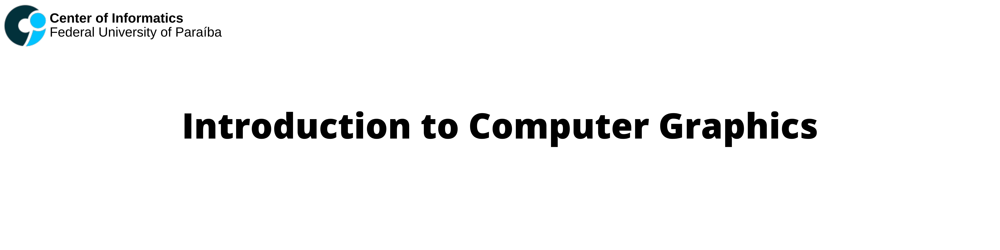

  

This repository contains the main algorithms developed in the course Introduction to Computer Graphics at [UFPB](https://www.ufpb.br), oriented by [Professor Christian Azambuja Pagot](http://buscatextual.cnpq.br/buscatextual/visualizacv.do?id=K4792938P3). The course uses JavaScript with the framework Three.js. 

## Table of Contents
- [References:](#references)
- [Assignments:](#assignments)

## References:
- Mathematical elements for computer graphics.  ROGERS, David; ADAMS, J. Alan.  NewYork:  McGraw-Hill, 1990.  611 p.  ISBN: 0070535299.
- Computer  graphics:   principles  and  practice.   FOLEY,  James  D;  DAM,  Andries  Van;FEINER, Steven K. Boston:  Addison-Wesley, 2a.  edição.  1996.  1175 p.  ISBN: 0201848406. (MAIN REFERENCE)

## Assignments:
 - [Assignment #1: Introduction to Rasterization Algorithms](https://github.com/mateustosta/computer-graphics/tree/master/Assignment%20%231/bresenham-line-algorithm)  
 - [Assignment #2: Implementation of Graphics Pipeline](https://github.com/mateustosta/computer-graphics/tree/main/Assignment%20%232/graphics-pipeline)
